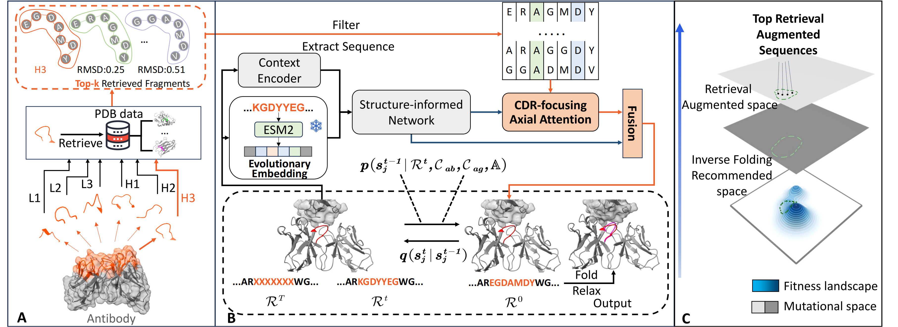

# RADAb

We propose a retrieval-augmented diffusion framework, termed RADAb, for efficient antibody design. Our method leverages a set of structural homologous motifs that align with query structural constraints to guide the generative model in inversely optimizing antibodies according to desired design criteria. 

### Requirements
You can create a new environment using the `requirements.txt` by  $ conda create --name `<env>` --file `requirements.txt`.

### Antibody dataset
Antibody structures in the `SAbDab` dataset can be downloaded [**here**](https://opig.stats.ox.ac.uk/webapps/newsabdab/sabdab/archive/all/). Extract `chothia` folder in `all_structures.zip` into the `./data` folder. 
### CDR motif retrieval
You can deploy ``MASTER`` by visiting [**master**](https://grigoryanlab.org/master/). It is used for retrieving CDR-like motifs. Retrieval process is implemented in `./motif_search/run_master.sh`.
### Model training
Training process is implemented in `train.py`. The configuration is in the `./config` folder.
### Evaluation
You can evaluate the generated structures by sequentially running `run_folding.py`, `run_relax.py`, and `run_eval.py`.

### Complete code
We are working on organizing the code and will release the code soon.

